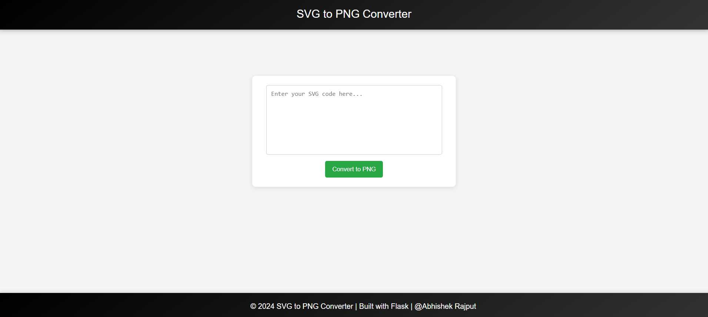
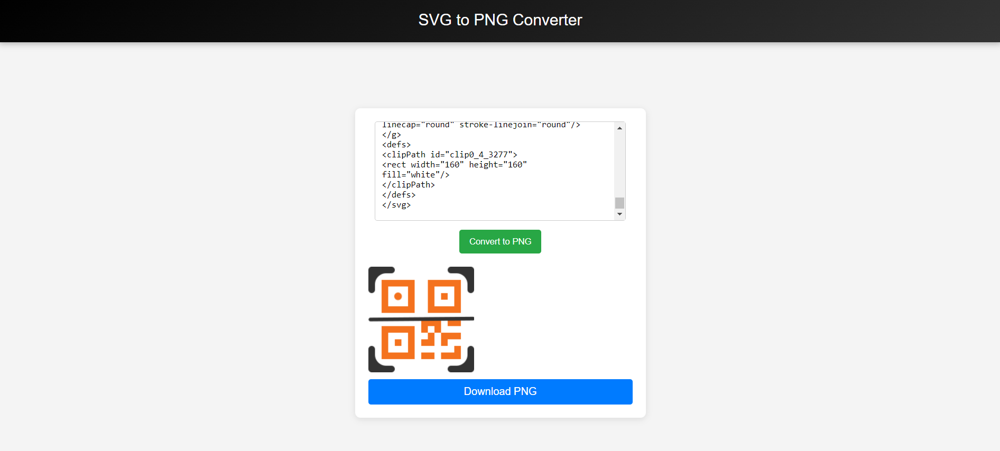
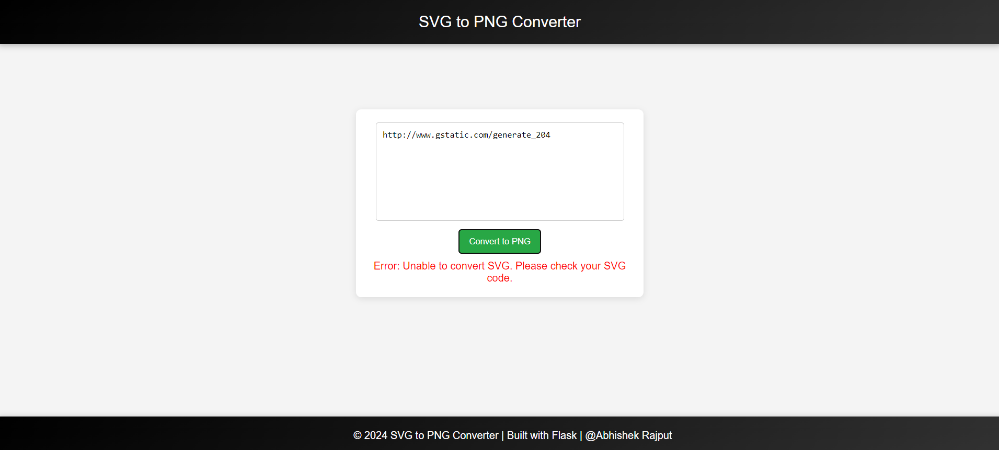

# SVG to PNG Converter

**SVG to PNG Converter** is a simple and efficient web application built with Flask and CairoSVG. It allows users to upload SVG code, convert it into a PNG image, and preview or download the PNG file with ease. The platform is designed for quick and easy use, offering features like image preview and seamless file download.

## Table of Contents

1. [Features](#features)
2. [Tech Stack](#tech-stack)
3. [Screenshots](#screenshots)
4. [Installation](#installation)
5. [Usage](#usage)
6. [Handling Errors](#handling-errors)
7. [Contributing](#contributing)
8. [Author](#author)

## Features

- **SVG to PNG Conversion**: Converts SVG code into PNG format with just a click.
- **Image Preview**: Preview the converted PNG directly within the app.
- **Download Option**: Download the converted PNG file to your local system.
- **Responsive Interface**: User-friendly interface for easy navigation and use.

## Tech Stack

- **Flask**: Backend framework used to handle server requests and routing.
- **CairoSVG**: Library used to convert SVG files to PNG format.
- **HTML/CSS**: For structuring and styling the front end.
- **JavaScript**: Used for handling user interactions on the client side.
- **Jinja2**: Templating engine used with Flask for rendering HTML templates.
- **Bootstrap**: For responsive and clean UI design.

## Screenshots





## Installation

Follow the steps below to set up the **SVG to PNG Converter** on your local machine:

1. **Clone the repository**:

   ```bash
   git clone https://github.com/Abhishek-2502/SVG_to_PNG_Converter.git
   ```
2. **Navigate to the project directory**:

   ```bash
   cd SVG_to_PNG_Converter
   ```
3. **Install the required packages**:

   ```bash
   pip install -r requirements.txt
   ```
4. **Run the Flask development server**:

   ```bash
   python app.py
   ```

## Usage

1. Open your web browser and go to `http://127.0.0.1:5000/`.
2. Enter your SVG code into the provided text area.
3. Click the 'Convert to PNG' button to convert your SVG to PNG.
4. Preview the PNG image and click on the 'Download PNG' button to save the file.

## Handling Errors

If an error occurs during the SVG conversion (e.g., due to invalid SVG code), the application will display an error message. Ensure that the SVG code is valid, or inspect the code for missing elements and retry.

## Contributing

Contributions are welcome and appreciated! 

## Author

Abhishek Rajput
